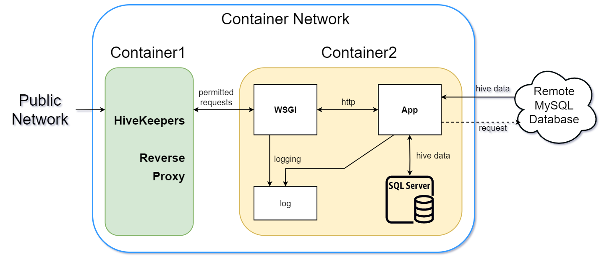

# HiveKeepers Internship Project
La Trobe University and HiveKeepers internship project

---

### Outline of project:
Build and present a containerised website for presenting apiary data from remote MySQL server, with user authentication and IP banning services.
  
The system comprises of two distinct Docker containers, running on their own private container network.  Each container is given a static IP address for reliable inter-container communication and referencing.  

---

**directory structure**  
```bash
project
├── container1
│   ├── docker-entrypoint.sh
│   ├── Dockerfile
│   ├── fail2ban                      <- fail2ban config dir
│   │   ├── action.d
│   │   │   └── docker-iptables-multiport.conf
│   │   ├── fail2ban.local
│   │   ├── filter.d
│   │   │   └── nginx-http-auth.conf
│   │   ├── jail.d
│   │   │   └── nginx.conf
│   │   └── jail.local
│   ├── fixed_envsubst-on-templates.sh
│   ├── healthcheck.sh
│   ├── monit                          <- monit watchdog config dir
│   │   ├── fail2ban.conf
│   │   ├── monitrc
│   │   └── nginx.conf
│   ├── nginx                          <- nginx proxy config dir
│   │   ├── default.old
│   │   ├── html
│   │   │   ├── background.jpg
│   │   │   └── index.html
│   │   ├── nginx.conf
│   │   └── templates
│   │       └── default.conf.template
│   └── password_script.sh
├── container2
│   ├── dash_app                       <- Python visual application config dir
│   │   ├── gunicorn_config.py
│   │   ├── hivekeepers_app.py
│   │   ├── hivekeepers_config.py
│   │   ├── hivekeepers_helpers.py
│   │   ├── requirements.txt
│   │   ├── start_app.sh
│   │   ├── startup_update_db.py
│   │   └── update_db.py
│   ├── docker-entrypoint.sh
│   ├── Dockerfile
│   ├── healthcheck.sh
│   └── monit                          <- monit watchdog config dir
│       ├── gunicorn3.conf
│       └── monitrc
├── docker-compose.yml
├── htpasswd                           <- default user:password file
├── README.md
└── scripts
    ├── password_script.sh             <- encrypted password script
    └── user_credentials.txt           <- example user:password file for script
```

---

### System Info
**names:**  
container1: reverse-proxy  
container2: dash-app  
  
**services:**  
container1: nginx, fail2ban, monit   
container2: Dash (Python), Gunicorn, monit   
  
**container network:**  
subnet: 172.75.0.0/16   
container1 ip: 172.75.0.2   
container2 ip: 172.75.0.3   
  
**in conantainer main working dir:**  
container2: /home/hivekeeper/  
  
**container persistent storage:**  
name: container_data:  
stores: logs (both containers), database (container1)  
container bind directory: /home/hivekeeper/persistent/  
  
**container1 persistent storage:**  
logs: /home/hivekeeper/persistent/logs/container1  
  
**container2 persistent storage:**  
logs: /home/hivekeeper/persistent/logs/container2  
database: /home/hivekeeper/persistent/db/  
  
**Default Visualisation App Access (through proxy; can be changed/removed):**  
Username: hivekeepers  
Password: hivekeepers  

---

**Software Versions**  
container1:
  
| service            | source                        | version       |
| ------------------ | ----------------------------- | ------------- |
| Docker base Image  | Docker Hub (NGINX official)   | nginx:1.20.2  |
| NGINX              | Baked into base image         | 1.20.2        |
| Fail2ban           | Debian repository             | 0.11.2        |
| Monit              | Debian repository             | 5.27.2        |
  
container2:
  
| service            | source                        | version             |
| ------------------ | ----------------------------- | ------------------- |
| Docker base Image  | Docker Hub (Debian official)  | debian:stable-slim  |
| Pyython            | Debian repository             | 3.9.2               |
| SQLite             | Debian repository             | 3.34.1              |
| Gunicorn3          | Debian repository             | 20.1.0              |
| Monit              | Debian repository             | 5.27.2              |
  
Python Libraries (requirements.txt):  
```bash
Brotli==1.0.9
click==8.0.3
colorama==0.4.4
dash==2.1.0
dash-bootstrap-components==1.0.3
dash-core-components==2.0.0
dash-html-components==2.0.0
dash-table==5.0.0
Flask==2.0.2
Flask-Compress==1.10.1
itsdangerous==2.0.1
Jinja2==3.0.3
MarkupSafe==2.0.1
multiprocess==0.70.12.2
numpy==1.22.2
pandas==1.4.0
plotly==5.6.0
python-dateutil==2.8.2
pytz==2021.3
six==1.16.0
tenacity==8.0.1
Werkzeug==2.0.3
sqlalchemy==1.4.31

```
---

**Environment Variables:**  
container1:

|                          |        |                                                                                             |
| ------------------------ | ------ | ------------------------------------------------------------------------------------------- |
| APP_PORT                 | INT    | Port to proxy to on container2, must match in both containers (defaults to 8050 if not set) |
| PROXY_LOG_LEVEL          | STRING | options: simple (no nginx access logging), detailed (with nginx access logging)             |
| NGINX_ERROR_LOG_LEVEL    | STRING | options: info, notice, warn, error, crit, alert, emerg (case sensitive)                     |
  
To get fail2ban to work with iptables requires container privilege capabilities to be used:  
```bash
cap_add:
  - CAP_NET_ADMIN
  - CAP_NET_RAW
```
  
container2:

|                          |        |                                                                                                   |
| ------------------------ | ------ | ------------------------------------------------------------------------------------------------- |
| MYSQL_USER               | STRING | username for remote MySQL DB                                                                      |
| MYSQL_PASS               | STRING | password or remote MySQL DB                                                                       |
| MYSQL_HOST               | STRING | URL for remote MySQL DB                                                                           |
| MYSQL_DB                 | STRING | database name of remote MySQL DB                                                                  |
| APP_WORKERS              | INT    | Gunicorn workers - defaults to number of cores                                                    |
| APP_THREADS              | INT    | Gunicorn threads - defaults to number of cores – 1                                                |
| APP_PORT                 | INT    | listening port for Gunicorn WSGI, must match in both containers (defaults to 8050 if not set)     |
| APP_LOG_LEVEL            | STRING | options: debug, info, warning, error, critical                                                    |
| START_TYPE               | STRING | options: Warm_Start, Cold_Start, Init_start (case sensitive) (defaults to  Warm_Start if not set) |

---

**For further explanation of each container settings see relevant file for comments:**  
docker-compose.yamp - container start, env, and runtime settings: storage, networking  
Dockerfile - for image build settings  
docker-entryfile.sh - for runtime start process, services, file management, logging  
healthcheck.sh - for docker healtcheck status request response  
  
**See relevent container sub-dir for releveant service configurations**  
/monit - for watchdog service  
/nginx - for proxy service  
/fail2ban -  for authentification ip banning service  
/dash_app - for python visualisation application service  

---

### Container Roles
**Container1**  
Container1 handles all incoming network requests to the container network, and proxies any permissible requests destined for container2 to its respective static IP address.  
  
To handle incoming requests, container1 runs the NGINX service on port 80.  To control access to the container network, NGINX has basic-auth turned on and references a user:password file (.htpasswd) to determine relevant access privileges.  I Have made it so the password file can be created outside of the container and either passed in via the Dockerfile, or shared via a --volume -v in docker-compose.yaml
  
To handle requests that fail NGINX basic-auth 5 times, container1 also runs the service Fail2ban.  Fail2ban monitors the NGINX error log and records the IP address of failed access attempts to its log for future reference.  Once an IP address has reached 5 failed attempts within a given time span (10 mins) the IP address is banned from future access for 10 minutes – the number of attempts. the time frame for attempts, and the ban time can all be configured within Fail2bans configuration file before container1 build time if desired.  See authentification section for further explanation.  

There is also a root web page for NGINX which shows a bee background and simple text telling which container it is on.  This is currently allowed access to all, but can be easily changed or removed entirely by editting the nginx default.conf.template file in container1/nginx/templates and rebuilding the container image.
  
Nginx only using port 80 currently - atm don't see any need for SSL, but that might change...  
  
Monit is used as the watchdog handler for monitoring the NGINX and Fail2ban services and restarts if either are found to be down/unresponsive.  
  
**Container2**  
Container2 runs the HiveKeepers data visualisation web application, which displays 2d and 3d charts from timeseries data collected from apiaries. The application is written in Python and relies heavily on the Plotly Dash visualisation library.  The Web Server Gateway Interface (WSGI) Gunicorn is used to handle all web requests to and from the application, and data for visualising is pulled from the HiveKeepers remote MySQL database and stored locally in an SQLite database.  
  
Contiainer2 has no exposed ports and is only accessible from outside the container network via the container1 reverse proxy.  

---

### Data Visualisation Application (Dash)
The data visualisation application is written using the Dash Plotl framework and consists of 4 plotted charts from data aquired from the Hivekeeper MySQL aviary database. 

The app is built using the main hivekeeper_app.py for the central logic, and the buiilding and displaying of charts.  There are two seperate database update scripts one for initial startup (startup_update_db.py) and one for updating incremental updates once a local database is in place.

There is also a helper script (hivekeepers_helpers.py) which houses the main functions for data handling (getting data from local SQLite db), data cleaning and data building for charts.

There is also a config file (hivekeepers_config.py) for storing relevant STATIC variables and the MySQL remote database credentials.  

These files are all stored in project folder: container1/dash_app/  
and on container2 in folder: /home/hivekeeper/dash_app/  

---

### Logging:
**Container1 logs:**  
entrypoint_log: /home/hivekeeper/persistent/logs/container1/entrypoint.log  
nginx_access_log: /home/hivekeeper/persistent/logs/container1/nginx-access.log  
nginx_error_log: /home/hivekeeper/persistent/logs/container1/nginx-error.log  
fail2ban_log: /home/hivekeeper/persistent/logs/container1/fail2ban.log  
monit_log: /home/hivekeeper/persistent/logs/container1/monit.log  
  
**Container2 logs:**  
entrypoint_log: /home/hivekeeper/persistent/logs/container2/entrypoint.log  
gunicorn_log: /home/hivekeeper/persistent/logs/container2/gunicorn.log  
gunicorn_error_log: /home/hivekeeper/persistent/logs/container2/gunicorn-error.log  
gunicorn_access_log: /home/hivekeeper/persistent/logs/container2/gunicorn-access.log  
monit_log: /home/hivekeeper/persistent/logs/container2/monit.log  

---

### Watchdog Services:
**Container1:**  
Software: Monit  
Monitoring: NGINX, Fail2ban  
Web-monitor portal: Yes  
  
Monit is set up to monitor NGINX and Fail2ban services every 2mins and reports the status of each and handles service restart duties if they are found to be inactive.  Nginx is monitored via PID file and /healthcheck on port 80 Nginx that returns http code 200 on success; Fail2ban is monitored via PID file and socket.
  
Monit also provides a web port to both monitor and control system services.  This portal is located on port 2812 of container1, and access is provided via NGINX reverse proxy features.  
  
  To access Monit’s web portal, visit http://localhost/monit/
      **credentials:**  
          username: admin  
          password: hivekeeper  
  
Monit config files are stored in project dir: container1/monit/  
  
**Container2:**  
Software: Monit  
Monitoring: Gunicorn3  
Web-monitor portal: No  
  
Monit is set up to monitor the Guniicorn3 service every 2mins and reports the status and handles service restart duties if they are found to be inactive.  Gunicorn is monitored via PID file and /ping on port 80 - /ping located in hivekeepers_app.py, which returns string: 'status: ok'  
  
Monit config files are stored in project dir: container2/monit/  
Gunicorn restart script is stored in project dir: container2/dash_app/start_app.sh  
  
**Command line access to watchdogs:**  
It is also possible to access and control watchdog states and status via the command line using: 
```bash
docker exec CONTAINER-NAME COMMAND ARGS
```
Available monit commands:
```bash
monit start all             			# Start all services  
monit start <name>          			# Only start the named service  
monit stop all              			# Stop all services  
monit stop <name>           			# Stop the named service  
monit restart all           			# Stop and start all services  
monit restart <name>        			# Only restart the named service  
monit monitor all           			# Enable monitoring of all services  
monit monitor <name>        			# Only enable monitoring of the named service  
monit unmonitor all         			# Disable monitoring of all services  
monit unmonitor <name>      			# Only disable monitoring of the named service  
monit reload                			# Reinitialize monit  
monit status [name]         			# Print full status information for service(s)  
monit summary [name]        			# Print short status information for service(s)  
monit report [up|down|..]   			# Report state of services. See manual for options  
monit quit                  			# Kill the monit daemon process  
monit validate              			# Check all services and start if not running  
monit procmatch <pattern>   			# Test process matching pattern  
```

---

### Getting started
1.	Clone the hivekeepers project repo to your local host  
2.	Install Docker  
3.	Create the user:password file using your preferred method – see below for options.  
4.	Edit the docker-compose.yml file to your preferred setting, adjust the options to fit your desired log level and location (hosted or in container only) and make sure the container1 htpasswd volume is pointing to your created user:password file  
 - or If wanting to store logs on host, make sure the log volume is pointing to the desired local directory path  
5.	Start build and start process with:  
  - To run live and see outputs: ‘docker-compose up  --build --remove-orphans’  
  - To run daemonised: ‘docker-compose up  -d --build --remove-orphans’  
6.	Browse to http://localhost/app/ to access the data visualisation app.  
  -	Enter username and password  
  -	**default user**  
    - username: hivekeepers  
    - password: hivekeepers  

7.	Enjoy your data visualisations!  
  
OPTIONAL  
8.  Browse to http://localhost/monit/ to access container1 watchdog status web portal
  - Enter username and password
  - **default user**  
    - username: admin  
    - password: hivekeeper

---

### User Authentication
NGINX basic authentication user access is managed through a txt file container user:password combinations for referencing requests against.  This file needs to be passed/shared with container1.  And while it is possible to simply pass such a file in plain text, it is much safer to first encrypt the passwords listed before doing so…  
  
The simplest way to make such an encrypted user:password file is to use the apache2-utils library on Linux – the following is for Debian systems but can be modified for others.  
  
To get the library installed run:  
```bash
‘apt-get update && apt-get install apache2-utils -y’
```
Then run as root, run:  
```bash
‘htpasswd -c .htpasswd username’
```
This will start the application, create the file, then ask you to input the password.  
  
To add more users, simply rerun the command, but use the -b flag in place of the -c flag.  
  
Or, if you have many users you wish to add, I have included a small BASH script (password_script.sh) that can automate the process by reading a plain text user:password structured file and converting it to an encrypted password version for you.  
  
This script is located within the /scripts directory within the main project directory.  
  
to use, create a text file with a user:password text pair per user, per line (see example file user_credentials.txt, also located in /scripts).  
Then call script with the text file as the first argument. e.g.:  
```bash
‘ ./password_script user_credentials.txt’
```
  
e.g., user_credentials.txt file layout for creating 3 users:  
```bash
user1:password1
user2:password2
user3:password3
```

---

### System Images
container1 system diagram:  

  
container2 system diagram:  

  
visualisation application header:  

  
visualisation application 2D Chart1:  

  
visualisation application 2D Chart2:  

  
visualisation application 3D Chart:  

  
visualisation application 4D Chart1:  

  
container1 monit web portal for manager:  

  
container1 monit web portal for service (eg. ngix):  

  
container1 root web page:  

